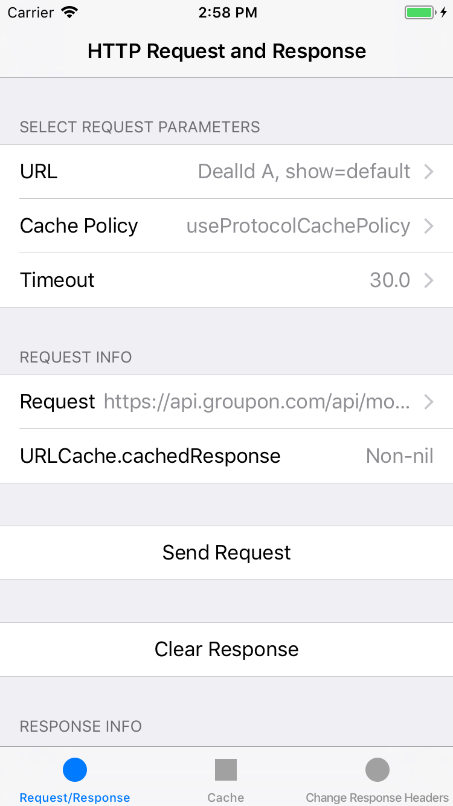
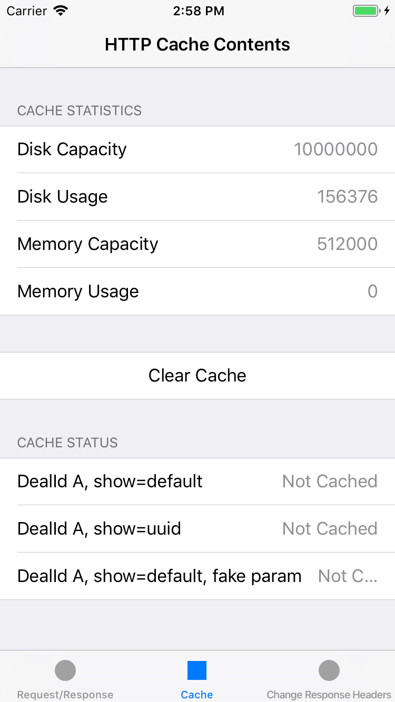
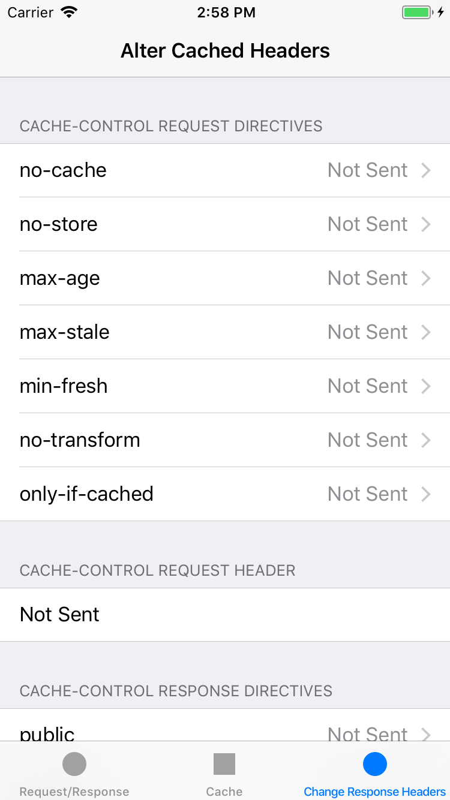

# ios-http-caching

This is a sample app which explores caching in HTTP 1.1.

This sample app contains three tabs, and looks like this:

The three tabs are:

- HTTP Request and Response Tab
- Cache Contents Tab
- Cache-Related Header Manipulation Tab

## HTTP Request and Response Tab

The purpose of this tab is to:

- Construct the URLRequest
- Send the request and view the response
- See whether or not the request was served from Local Cache or Network Fetch

### Constructing the URLRequest

Constructing the URLRequest consists of selecting three parameters:

- The URL to use
- The cache policy
- The request timeout

#### Selecting the URL

By default, you can select from three URLs:

1. A Groupon API Deal ID call with show=default. This should return most of the default information for a particular deal.
2. A Groupon API Deal ID call with show=uuid. This should return a minimal amount of information for a particular deal.
3. A Groupon API Deal ID call with show=default with a fake parameter.

#### Selecting the Cache Policy

You can set URLRequest.cachePolicy to any of the legal URLRequest.CachePolicy values:

1. useProtocolCachePolicy. This specifies that the caching logic defined in the protocol implementation, if any, is used for a particular URL load request. This is the default policy for URL load requests.
2. reloadIgnoringLocalCacheData. This specifies that the data for the URL load should be loaded from the originating source. No existing cache data should be used to satisfy a URL load request.
3. reloadIgnoringLocalAndRemoveCacheData. This specifies that not only should the local cache data be ignored, but that proxies and other intermediates should be instructed to disregard their caches so far as the protocol allows.
4. returnCacheDataElseLoad. This specifies that the existing cached data should be used to satisfy the request, regardless of its age or expiration date. If there is no existing data in the cache corresponding the request, the data is loaded from the originating source.
5. returnCacheDataDontLoad. This specifies that the existing cached data should be used to satisfy the request, regardless of its age or expiration date. If there is no existing data in the cache corresponding the request, then the request fails.
6. reloadRevalidatingCacheData. Specifies that the existing cache data may be used provided the origin source confirms its validity, otherwise the URL is loaded from the origin source.

#### Selecting the Timeout

You can select from various choices for timeout, all of which are in seconds.

### Send the Request and View the Response

- You can always view the current request by tapping the "Request" row in the Request Info section.
- To send the request in its present form, tap the "Send Request" button.
- To clear the response, tap the "Clear Response" button
- To see what URLCache.cachedResponse(forRequest:) returns, look at the "URLCache.cachedResponse" row. If it says "Non-nil", then the cache contains a response which matches the URLRequest. **Note that this does NOT mean that this response will necessarily be returned when you send the request.** Whether or not the cached response is returned is dependent upon a variety of factors.

### Determining if the request was served from Local Cache or Network Fetch

As noted above, you can see if a response exists in the cache for the current request by looking at the URLCache.cachedResponse row.

However, if you want to see if the current response was served from Local Cache or Network Load, then look at the "Fetch Type" row in the Response Info section:

- If it says Local Cache, then the request was served from on-device cache, and no network request was made.
- If it says Network Load, then the cache was missed and the request was served by a network fetch.

You can also see more metrics by tapping on the "Task Metrics Loaded" row. This will display all of the metrics which were collected during the execution of this URLSessionTask.

## Cache Contents Display Tab

This tab looks like this:

In this tab, you can:

- See statistics on the current state of the cache.
- Look at the cached responses for each of the defined URLs.

## Cache Header Manipulation Tab

This tab looks like this:

This tab allows you to:

- Set the Cache-Control request header
- Inject a Cache-Control header into the response headers BEFORE that response it put into the cache.
